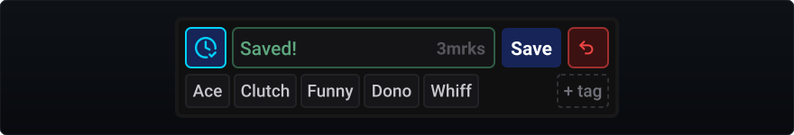
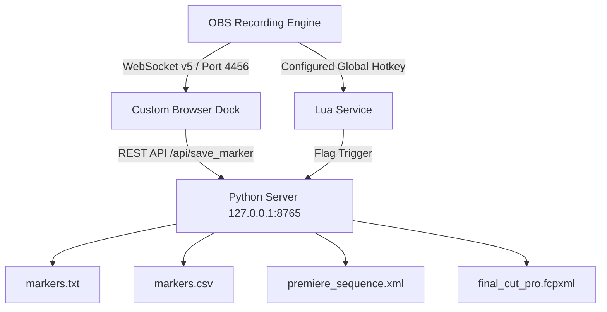

<div align="center">

# OBS Marker Tool

**Zero-overhead recording marker engine for OBS Studio.**  
Simultaneous marker export for major video editing software with in-game hotkey freeze and an ultra-compact dock.

[](https://github.com/Mudxiej/obs-marker-tool/releases/latest)
[](https://github.com/Mudxiej/obs-marker-tool/releases)
[](https://obsproject.com/)
[](https://github.com/Mudxiej/obs-marker-tool)
[](https://www.python.org/)
[](LICENSE)

[Quick Start](#quick-start-in-60-seconds) | [NLE Workflow](#nle-import-workflow) | [API Docs](#local-rest-api) | [Project Wiki](https://github.com/Mudxiej/obs-marker-tool/wiki)

<p align="center">
  
</p>

---

</div>

## Overview

When you are live streaming or recording, you are completely in the moment. When intense matches, funny interactions, or hype plays happen back-to-back, taking your hands off the controls to alt-tab and manually type out notes is impossible, and you inevitably forget what happened when.

**OBS Marker Tool** automates highlight tracking without pulling you out of the action. With a single keybind or click directly inside OBS, you capture the exact second something happens so you can easily remember and find it later. It lives 100% inside OBS with zero extra background apps, and writes timeline markers straight into Premiere Pro, Final Cut Pro, and DaVinci Resolve so your video editing software knows the exact context without scrubbing.

---

## Feature Comparison

| Capability | Manual Scrubbing | ChapterSRT Scripts | StreamUP Marker Plugin | **OBS Marker Tool** |
| :--- | :--- | :--- | :--- | :--- |
| **Premiere Pro XML** | None | Partial (SRT hack) | Yes | **Native Sequence XML** |
| **Final Cut Pro XML** | None | No | Yes | **Native FCPXML v1.9** |
| **Dock Profile** | None | None | Bulky UI Tab | **Ultra-Compact Dock** |
| **In-Game Hotkey Feedback** | None | Audio beep only | None | **Electric Cyan Flash** |
| **Atomic Undo Window** | None | Manual delete | None | **5-Second Contextual Rollback** |
| **Dark Theme Ergonomics** | None | Plain OS window | Heavy contrast | **Muted Sage** |
| **Lifecycle Daemon** | None | Manual terminal | OBS plugin hook | **Automated VBS / Lua hook** |

---

## Core Capabilities

| Pillar | How It Works | Streamer / Editor Benefit |
| :--- | :--- | :--- |
| **1. 100% Inside OBS** | Embedded ultra-compact browser dock + automated background Lua daemon. Starts and stops silently with OBS. | Zero third-party windows to manage. Doesn't steal screen real estate from audio meters or stream preview. |
| **2. Blind Hotkey Trigger** | Tap `hotkey` mid-game to freeze exact timecode. Fires a subtle Electric Cyan flash. | Never alt-tab or take your eyes off the match. Instant visual confirmation that the moment is captured. |
| **3. Instant NLE Import** | Simultaneously exports `premiere_sequence.xml`, `final_cut_pro.fcpxml`, and `markers.csv` next to video file. | Drag sequence into Premiere or FCP; all markers, names, and timecodes appear directly on the timeline. Zero scrubbing. |
| **4. Mistake-Proof Undo** | Contextual Red Undo button active for 5 seconds after any save. | Accidental presses can be reverted with 1 click. If 0 markers remain, auto-purges empty files from disk. |
| **5. Dark-Room Ergonomics** | Low-contrast Muted Sage save frame + ghost text. One-click preset chips (`Ace`, `Clutch`, `Funny`, `Dono`, `Whiff`) with right-click to delete. | Zero peripheral glare or eye strain on stream. Quick tagging without typing; manage presets with a single click. |
| **6. Auto YouTube Chapters** | Generates `markers.txt` starting with an automatic `00:00:00 - Intro` anchor. | Copy and paste directly into YouTube video descriptions to activate scrubbable chapters instantly. |

---

## Architecture Flow



---

## Quick Start in 60 Seconds

### Step 1: Install Files
1. Download the latest `obs-marker-tool_v1.0.0.zip` from [Releases](https://github.com/Mudxiej/obs-marker-tool/releases/latest).
2. Extract the archive.
3. Double-click **`install.bat`** (automatically deploys all plugin files to `%APPDATA%\obs-studio\scripts\obs-marker-tool\`).

### Step 2: Enable in OBS Studio
1. **Add Lua Service**:
   - In OBS, go to **Tools** -> **Scripts**.
   - Under the **Scripts** tab, click **+** and choose `marker_service.lua`.
2. **Add Dock Panel**:
   - In OBS, go to **Docks** -> **Custom Browser Docks...**.
   - **Dock Name**: `Marker Tool`
   - **URL**: `http://127.0.0.1:8765/`
   - Click **Apply** and dock the bar wherever convenient.
3. **Assign Hotkey**:
   - In OBS, go to **Settings** -> **Hotkeys**.
   - Search for `Marker Tool: Freeze Timestamp`.
   - Set to your preferred `hotkey` (or combo) and click **OK**.

> [!TIP]
> By default, markers save to the exact folder where your OBS video files are written. To specify a custom destination, open **Tools** -> **Scripts**, select `marker_service.lua`, and set **Save Location**.

> [!IMPORTANT]
> The marker dock activates automatically as soon as OBS starts recording (`outputActive: true`). When recording stops, it resets cleanly for the next session.

---

## NLE Import Workflow

<details>
<summary><b>Adobe Premiere Pro (Click to expand)</b></summary>

1. In Premiere Pro, choose **File** -> **Import...** (or `Ctrl + I`).
2. Select `premiere_sequence.xml` from your recording's marker folder.
3. A sequence opens in your Project Bin containing your timeline markers populated with names and timecodes.
4. Drag your video file onto the sequence: all chapter markers align with your clips.

</details>

<details>
<summary><b>Final Cut Pro (Click to expand)</b></summary>

1. In Final Cut Pro, choose **File** -> **Import** -> **XML...**.
2. Select `final_cut_pro.fcpxml` from the marker folder.
3. Final Cut Pro automatically creates a project populated with chapter markers and to-do notes at each exact frame.

</details>

<details>
<summary><b>DaVinci Resolve (Click to expand)</b></summary>

1. In DaVinci Resolve, go to **File** -> **Import Timeline** -> **Import XML...**.
2. Select `final_cut_pro.fcpxml`.
3. Alternatively, right-click the timeline in the Edit page -> **Timelines** -> **Import** -> **Timeline Markers from CSV...** and select `markers.csv`.

</details>

<details>
<summary><b>YouTube Chapters (Click to expand)</b></summary>

1. Open `markers.txt`.
2. Copy the formatted list:
   ```text
   00:00:00 - Intro
   00:03:15 - Ace Round 4
   00:08:42 - 1v3 Clutch
   00:14:20 - Outro
   ```
3. Paste directly into your YouTube video description. YouTube automatically creates chapter markers for viewers.

</details>

---

## Local REST API

The local daemon listens on `127.0.0.1:8765`:

| Endpoint | Method | Payload | Function |
| :--- | :--- | :--- | :--- |
| `/api/status` | `GET` | None | Returns active session metadata, marker count, recording directory, and last freeze event. |
| `/api/save_marker` | `POST` | `{"timecode": "00:01:23", "name": "Ace"}` | Writes new marker entry across TXT, CSV, Premiere XML, and FCPXML simultaneously. |
| `/api/undo_marker` | `POST` | None | Removes last saved marker. Purges directory if count reaches 0. |
| `/api/reset_session`| `POST` | None | Concludes session state on recording stop. |
| `/api/config` | `POST` | `{"recording_dir": "..."}` or `{"custom_output_dir": "..."}` | Updates dynamic output targets from OBS WebSocket. |
| `/api/open_folder` | `POST` | None | Opens the active session folder in Windows Explorer. |

---

## Contributing & License

Contributions, bug reports, and pull requests are welcome. Please refer to our [Issue Templates](.github/ISSUE_TEMPLATE/) for filing bugs or proposing features, and consult the [Wiki Documentation](docs/wiki/Home.md) before submitting pull requests.

Distributed under the **MIT License**. See [LICENSE](LICENSE) for details.
